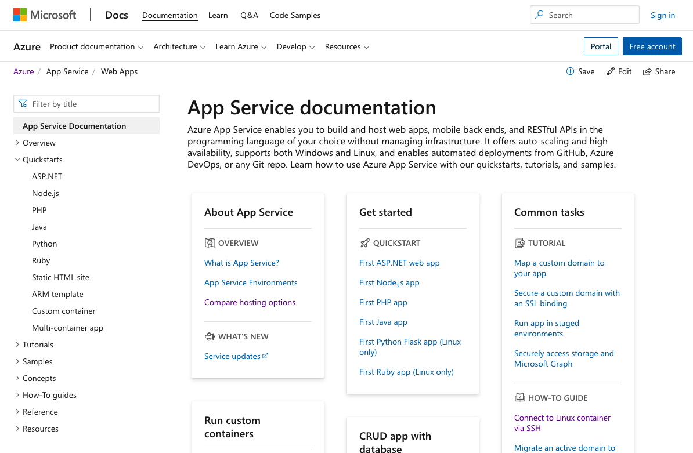

# Azure in a project, 1 month status report

## Project overview

Three tier.

- Frontend (JAM stack web client)
- Backend (API Docker)
- Database

## Azure Cloud vs Azure Devops vs Azure Active Directory

Single sign on using azure login.

Avoid mixing if possible. 👎

### Links

Looks hierarchal but seems not to be.

- https://docs.microsoft.com/en-us/azure/
- https://docs.microsoft.com/en-us/azure/devops/
- https://docs.microsoft.com/en-us/azure/active-directory/

## Azure Devops

We are not using it, nothing to say.

## Azure Active Directory (AD)

A hosted AD which can be used as, an AD.

And used as for Azure Cloud permission model.

- I find it unclear what im configuring. 👎
  - Could be custom users / groups /roles on Application level.
  - Could be system accounts on Infrastructure level.
- Sort of good to have both. 👍

## Azure Cloud

Azure Cloud resource grouping. 👍

- Subscription
- Resource Group

Single sign on using azure login can have access to multiple subscriptions.

- Account (azure login)

## Documentation

- https://docs.microsoft.com/en-us/azure/
- https://docs.microsoft.com/en-us/azure/devops/ seems related 👎
- https://docs.microsoft.com/en-us/azure/active-directory/

Google works well for search.

Example: https://docs.microsoft.com/en-us/azure/app-service/

Read the "overview"! 👍
(Even if the documentation emphasizes quickstarts more).

"Concepts" can also be great. 👍

### Compute decision tree

https://docs.microsoft.com/en-us/azure/architecture/guide/technology-choices/compute-decision-tree

## Azure Portal

It's a GUI to access your account. With all the pros and cons that a GUI have.

- Easy to explore.
- Hard to reproduce.

Very much on par with AWS or Google Cloud.

## Azure CLI

It's a command line interface (CLI). With all the pros and cons of a CLI.

- Easy to reproduce.
- Easy to store in version control.
- Harder to explore.

I think the `azure-cli` is a good CLI.
Consistent naming, support for all the services I have used.

## Infrastructure as Code (IaC)

We are using Azures own Azure Resource Manager (ARM) system for all our Azure Cloud components. From the start, with no more than expected overhead.

Had to qualify "Azure Cloud components", since all AD setup is done manually via the portal.

### Terraform

There is support for Terraform. https://docs.microsoft.com/en-us/azure/developer/terraform/

We have not used it. But find it reassuring that it exists, in case we need to go cross cloud. There is no indication that AWS or Google Cloud should be used, but Akamai is likely and MongoDB Atlas is possible.

### Azure Resource Manager (ARM)

Like CloudFormation (AWS) or Terraform (I have used it for Google Cloud).

Similar concepts, similarly good. I like it.

Export resource group as template! 👍
(Best template creation that I have worked with.)

## Components

Client, API, Database.

### Azure Storage

Blob storage with static http hosting.

### Azure App Service / Azure Web App

"Upload your code and we'll run it" service. Which also supports custom containers.

### Azure Database for PostgreSQL server

One month status report...

We have verified that there is a Postgres service and done some experimentation, but the database is not ready yet.
